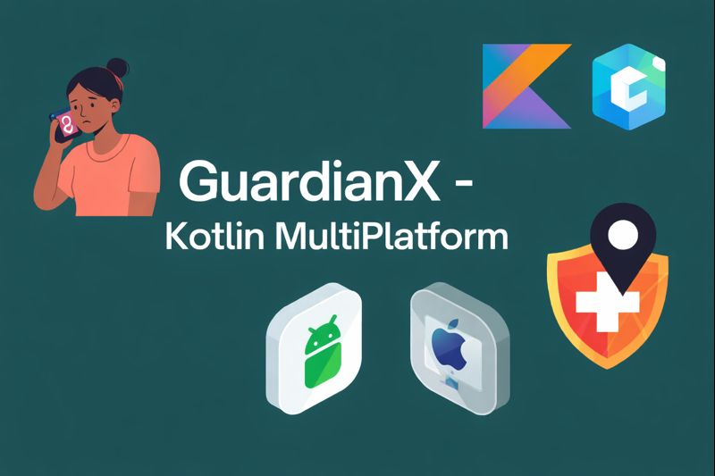

# GuardianX
### Personal Safety & Emergency Response App
**Built with Kotlin Multiplatform & Compose Multiplatform**

---

## Overview

**GuardianX** is a personal safety and emergency response application designed to help individuals respond quickly to dangerous situations such as kidnapping, assault, medical emergencies, and unsafe transportation scenarios.

The app enables users to trigger emergency alerts with a single tap, share their real-time location with trusted contacts, and notify emergency responders through a backend-powered alert system.

GuardianX is built using **Kotlin Multiplatform**, allowing shared business logic across **Android, iOS, and Desktop**, while using **Compose Multiplatform** for the user interface — all written entirely in Kotlin.

---

## Core Features

### 🆘 Emergency SOS
- One-tap SOS trigger
- Sends real-time location updates
- Silent mode for discreet emergencies

### 📍 Live Location Tracking
- Continuous GPS tracking during emergencies
- Map-based visualization
- Auto-stop after safety confirmation

### 👥 Trusted Contacts
- Add emergency contacts
- Prioritized alert delivery
- Location sharing links

### 🏠 Safety Dashboard
- Emergency status overview
- Safety tips based on region
- Last known location display

---

## Problem Statement

In many regions, including Nigeria, individuals face increasing safety risks due to kidnapping, violence, and delayed emergency response. Victims often lack the ability to quickly notify trusted contacts or share their precise location during emergencies.

GuardianX addresses this challenge by providing an instant, automated emergency response system that minimizes reaction time and improves situational awareness.

---

## Target Users

- Students and daily commuters
- Public transport and ride-hailing users
- Women and vulnerable individuals
- Travelers and families concerned about safety

---

## Why This Matters

Delayed emergency response can cost lives. GuardianX empowers users by:
- Reducing emergency response time
- Automating alerts and location sharing
- Providing a reliable safety companion

This project focuses on **real-world impact** and **social good**.

---

## Demo

🎥 **Demo Video**  

---

## Tech Stack

### Frontend
- **Kotlin Multiplatform**
- **Compose Multiplatform**
- MVI Architecture
- Kotlin Coroutines & Flow

### Backend
- **Ktor**
- REST APIs
- JWT Authentication

### Database
- **MongoDB**
- Emergency logs
- User & contact data

---

## Architecture Overview

| Layer | Description |
|----|----|
| Presentation | Compose Multiplatform UI + MVI |
| Domain | Shared business logic & use cases |
| Data | Repositories, APIs, MongoDB models |

### Code Sharing
- **Data Layer:** ~100% shared
- **Domain Layer:** ~100% shared
- **Presentation Logic:** Shared states & events
- **Platform Code:** Permissions & lifecycle handling
- Google Maps SDK integration or Platform Location APIs
---

## Data Handling

The current version of GuardianX uses a functional backend powered by **Ktor** and **MongoDB**.  
The backend handles:
- Emergency event storage
- Location updates
- Alert processing

Mock data is used where necessary to demonstrate flows during development.

---

## Future Improvements

- Integration with local emergency agencies
- Community responder network
- Offline SMS-based SOS
- AI-based danger detection
- Transport safety mode

---

## License

GuardianX is licensed under the **MIT License**.
